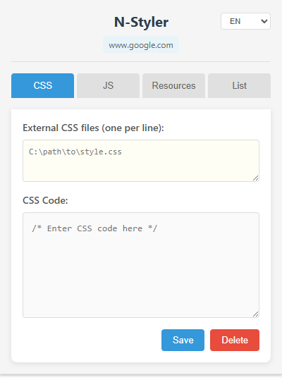
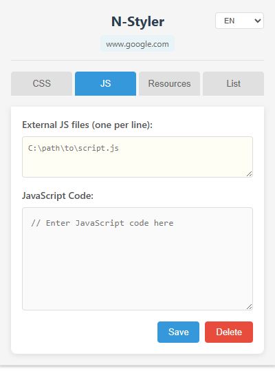
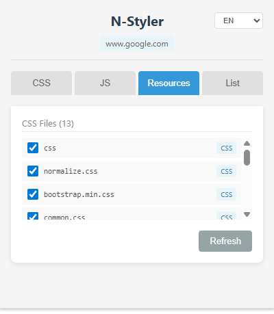
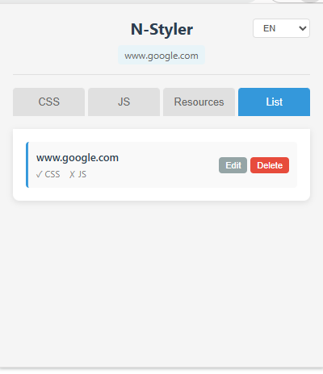
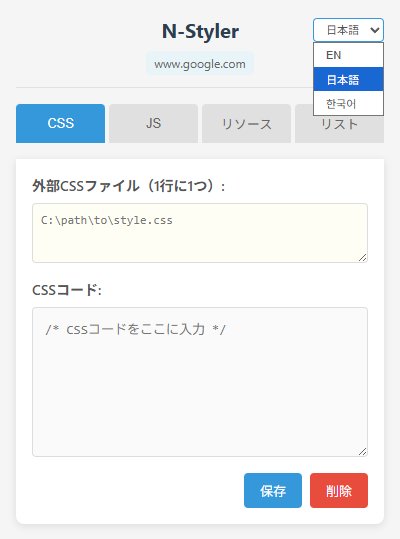

# N-Styler

[English](README.en.md) | **한국어** | [日本語](README.ja.md)

웹 페이지에 커스텀 CSS와 JavaScript를 주입할 수 있는 크롬 확장 프로그램입니다.

## 주요 기능

- **도메인 기반 스타일/스크립트 관리**: 도메인별로 CSS와 JS를 등록하고 자동 적용
- **외부 파일 지원**: 로컬 또는 원격 CSS/JS 파일 경로 등록 가능
- **페이지 리소스 관리**: 페이지에 로드된 CSS 리소스 확인 및 토글
- **실시간 적용**: 페이지 새로고침 없이 즉시 적용
- **다국어 지원**: 영어, 일본어, 한국어 UI 지원
- **간편한 관리**: 직관적인 팝업 UI를 통해 쉽게 관리

## URL 매칭 방식

**도메인(hostname) 기준** 매칭을 사용합니다:
- `example.com`의 모든 페이지에 동일한 스타일 적용
- 서브도메인 구분 가능 (`www.example.com` ≠ `api.example.com`)
- 쿼리 파라미터나 경로에 영향받지 않음

## 설치 방법

### 개발자 모드 (로컬)
1. 크롬 브라우저에서 `chrome://extensions` 접속
2. 우측 상단 "개발자 모드" 활성화
3. "압축해제된 확장 프로그램을 로드합니다" 클릭
4. `dist` 폴더 선택

### Chrome 웹 스토어
- [Chrome Web Store에서 설치](#) (출시 후 링크 업데이트)

## 사용 방법

1. 확장 프로그램 아이콘 클릭
2. **CSS/JS 탭**: 커스텀 코드 입력
3. **External 탭**: 외부 파일 경로 등록
4. **Resources 탭**: 페이지 CSS 리소스 토글
5. "Save" 버튼 클릭 - 즉시 적용!

## 스크린샷

| CSS 편집 | JavaScript 편집 | CSS 리소스 필터 |
|---------|-----------------|-----------------|
|  |  |  |

| 규칙 관리 | 다국어 지원 |
|----------|-----------|
|  |  |

## 폴더 구조

```
N-Styler/
├── src/                    # 개발 소스 코드
│   ├── _locales/           # 다국어 지원 (en, ja, ko)
│   ├── background/         # 백그라운드 스크립트
│   ├── content/            # 콘텐츠 스크립트
│   ├── icons/              # 확장 프로그램 아이콘
│   ├── popup/              # 팝업 UI
│   └── manifest.json       # 확장 프로그램 설정
├── dist/                   # 배포용 파일
├── README.md               # 프로젝트 설명
├── TODO.md                 # 개발 계획
├── store-description.md    # 스토어 설명 문구
└── N-Styler.zip            # 배포용 ZIP 파일
```

## 개인정보 처리

- 모든 데이터는 브라우저 로컬에 저장됩니다
- 외부 서버로 데이터가 전송되지 않습니다

## 라이센스

MIT License © 2026 N-Styler Contributors

자세한 내용은 [LICENSE](LICENSE) 파일을 참고하세요.
